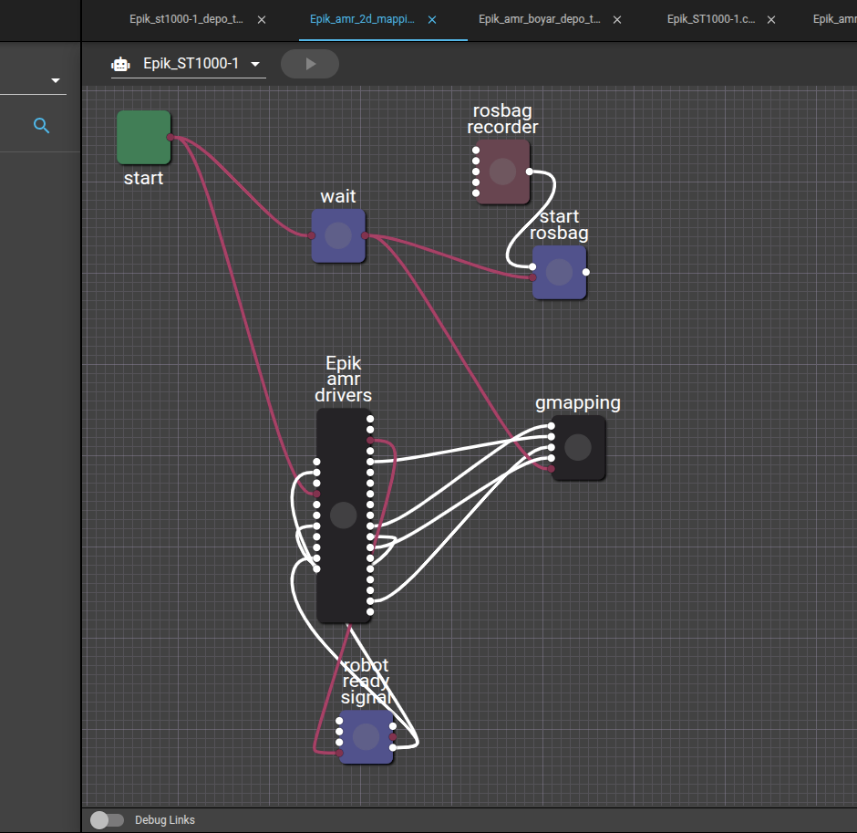

# Installation

The trainee needs to have this computer hardware or similar as the training is given with simulation:
- Ubuntu 20.04.6 Server Edition
- I9 13900KF 24 Cores
- Inno3D RTX 4090 24GB (i.e. a powerful graphics card can be either - - NVIDIA or AMD)
- 64GB RAM
- 500GB SSD
The following variables should be set in `~/.bashrc` file or exported:
1. ```${USERSPACE_FOLDER_PATH}```: The robot’s userspace
```export USERSPACE_FOLDER_PATH="${HOME}/robots/<robot-name>/userspace"```

```mkdir -p ${USERSPACE_FOLDER_PATH}```

```mkdir -p ${USERSPACE_FOLDER_PATH}/models_shared```
   
2. `${PUBLIC_IP}`: The robot’s IP, use the command `ip -br -4 addr show docker0` to know which one to use:
export PUBLIC_IP="172.17.0.1"
   
3. `${SIMULATION_ID}`: The robot’s Ignition partition, should be unique for each user so you can set it to:
export SIMULATION_ID="${USER}-${HOSTNAME}"
   
4. ${DISPLAY}: Already is an environment variable, there is no need to set it

Afterwards, to install MOV.AI run the following steps:

```
wget https://movai-scripts.s3.amazonaws.com/QuickStart_1.0.43.bash
```

```
bash QuickStart_1.0.43.bash --apps 2.3.1-12 basic-standalone-ignition-noetic.json
```

5. Create a  new user using the following command : 

    ``` movai-cli user <robot_name> <usrename> <password>```

6. Apply all the changes using the following command:
`movai-cli all <robot_name>  --follow `


Inside manger .bashrc add these commands:


```#source /usr/share/movai-cheatsheet/env.sh
export USERSPACE_FOLDER_PATH="${HOME}/robots/amr/userspace"
mkdir -p ${USERSPACE_FOLDER_PATH}
mkdir -p ${USERSPACE_FOLDER_PATH}/models_shared
#export PUBLIC_IP="192.168.3.146"
export SIMULATION_ID="${USER}-${HOSTNAME}"
export MANAGER_IP="192.168.3.146"
export PATH=$(go env GOPATH)/bin:$PATH
```
#### MOV.AI cheat sheet installation:
```
curl -fsSL https://artifacts.cloud.mov.ai/repository/movai-applications/gpg | sudo apt-key add
```
```
sudo add-apt-repository "deb [arch=all] https://artifacts.cloud.mov.ai/repository/ppa-testing testing main"
```
```
sudo apt update && sudo apt install movai-cheatsheet
Add to source /usr/share/movai-cheatsheet/env.sh to your ~/.bashrc.
```


# Mapping
- Depends on the robot there is a specfic flow for mapping inside the manager e.g for AMR its ``` Epik_amr_2d_mapping ```




# Troubleshoot
- use this command to get rid of password prompt while modifing the settings.
```
sudo gnome-control-center
```
- Sometime Ubuntu Gnome doesnt work so use ``` blueman-manager``` to connect to bluetooth.
